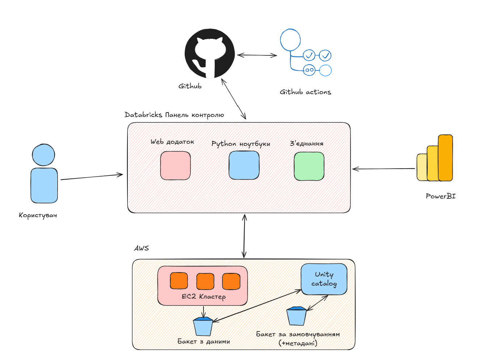

# Вступ

Цей проєкт відповідає за розгортку AWS у Databricks за допомогою terraform, та організує щоденну обробку та візуалізацію погодних даних, з використанням підходів DevOps i IAC

# Файлова структура

```
.
├── README.md
├── .github/workflows/
│   └── deploy.yml
├── databricks
│   ├── databricks.yml
│   └── process_weather.py
└── terraform
    ├── databricks.tf
    ├── iam.tf
    ├── outputs.tf
    ├── providers.tf
    ├── root_storage.tf
    ├── variables.tf
    ├── vpc.tf
    └── workspaces.tf
```

# Terraform

Розгортання самого середовища відбувається за допомогою terraform.

Для цього треба налаштувати автентифікацію через `aws cli` та активувати підписку на Databricks y AWS Marketplace.

Далі потрібно виконати команди

```bash
cd terraform
terraform init
terraform apply
```

Після цього середовище databricks буде готове та посилання на нього буде виведено.

# Databricks

Databricks налаштований з Unity Catalog, дані каталогу sandbox зберігаються в s3 бакеті за допомогою External Location та Credential, обробка даних та створення таблиць за їх ненаявності відбувається за допомогою ноутбуку `databricks/process_weather.py` та відбувається по розкладу кожний день, організовано за допомогою Jobs, що розгорнуті через `databricks bundle deploy` (`databricks/databricks.yml`)

# Архітектура рішення


